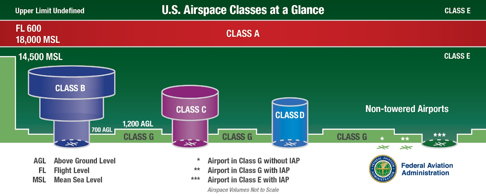

Wait, as an S1 I can only do stuff with airplanes on the ground. Why do I care about all these kinds of airspace?

As Clearance Delivery or Ground controller, it is your job to prepare the aircraft for entry into the National Airspace System once they depart. This includes ensuring that certain airspace entry requirements are met, and reviewing flight plans for any issues related to airspace restrictions. This knowledge will also serve as a good foundation as you continue your ATC training.

Here are 6 main classes of airspace in the US designated by letters. We will cover them in order from most restrictive to least restrictive, which also happens to be alphabetical order. See the [AIM](https://www.faa.gov/air_traffic/publications/atpubs/aim_html/chap3_section_2.html) for more details on controlled airspace classes.

## Class A

Class A airspace begins at 18,000 feet and extends up to FL600. Aircraft must be on an IFR flight plan. If they are navigating via VORs above FL240, they also need DME or GPS. How do you know what equipment they have? By looking at the [equipment suffix](../equipment-suffixes/) in the filed flight plan.

Class A airspace is not depicted on charts since it exists everywhere between the same altitudes.

## Class B

Class B airspace surrounds the busiest airports. VFR aircraft are allowed, but **must be explicitly cleared into the airspace** by ATC. IFR aircraft must have an operable VOR/TACAN receiver or RNAV system. All aircraft must have **two-way radio contact** with ATC (which they probably have if they got a clearance) and a **Mode C transponder**.

Class B airspace is depicted on VFR charts with thick blue lines. The extents vary based on each airport, but the ceiling is generally up to 10,000 feet. The altitude limits are depicted in the same blue color. The chart excerpt on the right depicts three different areas with different altitude limits in hundreds of feet.



### Mode C veil

You'll also notice a magenta circle extending 30 NM centered around the main airport. This is referred to as the Mode C veil. All aircraft in this area must have Mode C transponders, even outside of class B airspace.

## Class C

Class C airspace is similar to class B airspace, but smaller and less restrictive. All aircraft must have **two-way radio contact** with ATC and a **Mode C transponder**.

Class C airspace is depicted on VFR charts with magenta lines. It generally extends up to 4000 feet AGL. The altitude limits are similar to class B with floors and ceilings of each area in hundreds of feet. The inner circle is generally 5 NM in radius, and the outer circle is 10 NM in radius.



## Class D

Class D airspace exists around almost all towered fields that aren't Class B or C. All aircraft must have **two-way radio contact** with ATC.

Class D airspace is depicted on VFR charts with dashed blue lines. It generally extends up to 2500 feet AGL. The ceiling is depicted in a blue four-cornered box in hundreds of feet. A minus in front of the altitude indicates "up to but not including." The airspace generally extends 5 NM from the airport, but is tailored for each airport's operations.

Note that some Class B/C airports (like SEA) may also have some areas of Class D airspace.



## Class E

Class E is the last class of controlled airspace and the least restrictive. VFR aircraft have no special entry requirements and are not required to be in two-way radio contact with ATC.

Class E is the most complicated class to interpret on a chart. The upper limit is always going to be the class of airspace that exists above it (usually Class A, or a shelf of B or C). The **lower limit in most places is 1200 ft. AGL**, but it depends on the area.

When Class E extends to the surface, it is depicted with a magenta dashed line similar to the blue Class D areas. This protects instrument procedures either at non-towered fields or adjacent to Class D areas.

When Class E extends down to 700 ft. AGL, it is inside of a magenta vignette. This may be limited to a single airport, or surround larger areas that contain many airports.

When Class E extends down to only 14500 MSL, it is outside of a blue vignette. Note that the dark edge of the vignette is the one that abuts this higher Class G airspace.

Different airspaces with Class E floors above 700 ft. AGL are separated with a blue zipper line and the altitudes are depicted on either side.





























## Class G

Class G is the last class of airspace. It is uncontrolled, so there are **no specific entry requirements** for aircraft.

Class G airspace exists from the surface (except Class B/C/D/E surface areas) to the beginning of class E airspace. You will only see it explicitly shown on a chart in some cases where it abuts Class E airspace.



## Terminal Radar Service Area (TRSA)

Wait, this isn't an airspace class! But it's not technically Special Use Airspace either.

There are **no requirements** for pilots to operate in a TRSA. VFR pilots may optionally contact ATC for services in these areas. ZSE does not have any TRSAs.

TRSAs are depicted on VFR charts with lines similar to Class B/C except in gray, and their altitude limits are depicted in black numbers in hundreds of feet.



## Airspace classes in practice

As a ground controller, knowing the airport's airspace class is most important when working with pilots flying VFR. Understanding the airspace around the airport will ensure you deliver the correct information to the pilot when they make initial contact with you.

### Example 1

You are controlling ground at KHIO. What is the airspace class?

{}

Class D.



{}

### Example 2

You are controlling ground at KPDX. What is the airspace class?

{}

Class C.



{}

### Example 3

You are controlling ground at KSEA. What is the airspace class?

{}

Class B.



{}
